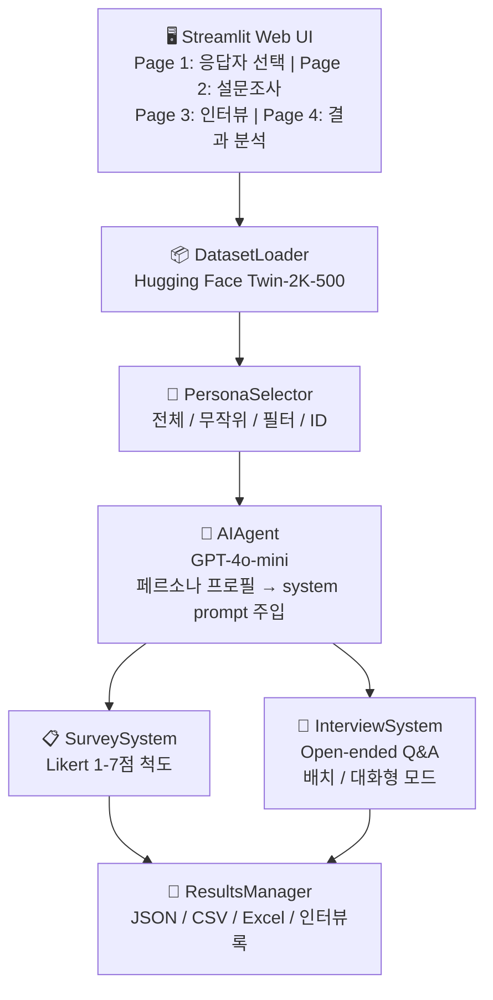

# 🧠 LLM Customer Digital Twin

> **Built:** October 2025

LLM 기반 디지털 트윈 시스템 — 실제 사람 데이터셋으로 가상 인터뷰이를 생성하고, 설문조사·심층 인터뷰를 자동화합니다.

---

## 1. Overview

기존 사용자 리서치 방법론의 한계(비용, 시간, 샘플 편향)를 극복하기 위해, Hugging Face의 [Twin-2K-500](https://huggingface.co/datasets/LLM-Digital-Twin/Twin-2K-500) 데이터셋을 활용해 2,000명 이상의 실제 인물 프로필을 LLM에 주입하여 가상 인터뷰이로 활용합니다.

**핵심 가치:**
- 실제 설문 전 질문 검증 및 응답 분포 예측
- 다양한 페르소나의 반응을 대규모로 빠르게 수집
- 정성 연구(인터뷰)를 정량적으로 확장

**데이터셋:** 2,000명+ 실제 인물 프로필, 각 인물의 배경·성격·가치관 포함

---

## 2. Architecture



**데이터 흐름:**
1. `DatasetLoader` — Hugging Face에서 Twin-2K-500 로드
2. `PersonaSelector` — 필터링/무작위/ID 기반 응답자 선택
3. `AIAgent` — 선택된 페르소나 프로필을 system prompt에 주입
4. `SurveySystem` / `InterviewSystem` — 질문 배치 처리 및 응답 수집
5. `ResultsManager` — 다중 포맷 저장 및 통계 분석

---

## 3. Tech Stack

| 범주 | 기술 |
|------|------|
| **LLM** | OpenAI GPT-4o-mini |
| **Frontend** | Streamlit |
| **Data** | Hugging Face Datasets (Twin-2K-500) |
| **Analysis** | Pandas, NumPy, Plotly |
| **Export** | openpyxl (Excel), JSON, CSV |
| **Config** | python-dotenv |
| **Language** | Python 3.8+ |

---

## 4. Core Logic

### 페르소나 주입 방식

각 응답자의 프로필을 LLM system prompt에 직접 삽입하여, LLM이 해당 인물처럼 응답하도록 유도합니다:

```python
from src.dataset_loader import DatasetLoader
from src.ai_agent import AIAgent
from src.survey_system import SurveySystem

loader = DatasetLoader()
loader.load()
personas = loader.get_random_sample(n=10)

agent = AIAgent()  # GPT-4o-mini
survey_system = SurveySystem(agent)
survey = survey_system.Survey("기술 수용도 조사", "AI에 대한 태도 조사")
survey.add_question("AI 기술이 사회에 긍정적 영향을 미칠 것이라고 생각합니까?")

responses = survey_system.conduct_survey(personas, survey)
```

### 응답자 선택 모드 (4가지)
- **전체 선택**: 전체 데이터셋 대상
- **무작위 샘플링**: n명 랜덤 추출
- **조건 기반 필터링**: 나이, 직업 등 속성 필터
- **ID 직접 선택**: 특정 인물 지정

### 인터뷰 모드 (2가지)
- **배치 모드**: 대량 인터뷰 자동 진행, 결과 일괄 저장
- **대화형 모드**: 응답에 따른 후속 질문 가능

### 응답 생성 메커니즘
- 기본 API 호출 딜레이: 0.5초 (레이트 리밋 방지)
- 모델: `gpt-4o-mini` (비용 효율) / `gpt-4o` (고품질) 선택 가능
- 설문: 1-7점 리커트 척도 구조화 응답
- 인터뷰: 개방형 자유 응답

---

## 5. Evaluation

| 항목 | 내용 |
|------|------|
| **Persona Fidelity** | Twin-2K-500 인물 속성(나이·직업·가치관)과 LLM 응답 간 일관성 — 속성 키워드 매칭률로 정성 평가 |
| **Response Validity** | 리커트 척도 응답이 1-7 범위를 벗어나는 비율 측정 (형식 준수율) |
| **Coverage** | 설문/인터뷰 완료율 — 네트워크 오류·API 실패로 인한 누락 응답 비율 |
| **Future Improvements** | 실제 설문 결과와 LLM 시뮬레이션 결과 간 분포 비교 (Ground-truth validation), 페르소나 충실도 자동 채점 도입 검토 |

---

## 6. Production Considerations

| 항목 | 내용 |
|------|------|
| **Rate Limit** | API 호출 간 0.5초 딜레이 기본 적용, 대규모 배치 시 조정 권장 |
| **Cost Control** | `gpt-4o-mini` 선택으로 비용 최소화; 대량 인터뷰 시 토큰 사용량 모니터링 필요 |
| **Auth Security** | 관리자/사용자 자격증명은 `.env`의 `AUTH_USER_ID`, `AUTH_USER_PW`, `AUTH_ADMIN_ID`, `AUTH_ADMIN_PW`로 관리 (하드코딩 금지) |
| **Data Privacy** | Twin-2K-500은 공개 연구 데이터셋이나, 추가 개인 데이터 결합 시 개인정보 처리 정책 검토 필요 |
| **Scalability** | 현재 in-memory 처리; 2,000명 이상 대규모 배치는 청크 분할 처리 권장 |
| **Output Storage** | JSON/CSV/Excel 결과 파일은 `.gitignore`로 제외 — 민감 응답 데이터 공개 방지 |

---

## 7. Deployment

### 로컬 실행

```bash
# 1. 저장소 클론
git clone https://github.com/pynoodle/llm-customer-digital-twin.git
cd llm-customer-digital-twin

# 2. 가상환경 생성 및 활성화
python -m venv venv
# Windows
venv\Scripts\activate
# macOS/Linux
source venv/bin/activate

# 3. 의존성 설치
pip install -r requirements.txt

# 4. 환경 변수 설정
cp .env.example .env
# .env 파일에 OPENAI_API_KEY 및 AUTH 정보 입력

# 5. Streamlit 앱 실행
streamlit run app.py
# → http://localhost:8501
```

### 환경 변수 (.env)

```bash
OPENAI_API_KEY=your_api_key_here
AUTH_USER_ID=your_user_id
AUTH_USER_PW=your_user_password
AUTH_ADMIN_ID=your_admin_id
AUTH_ADMIN_PW=your_admin_password
```

### CLI 실행

```bash
python main.py
```

### 프로젝트 구조

```
llm-customer-digital-twin/
├── src/
│   ├── dataset_loader.py      # Twin-2K-500 로딩 및 관리
│   ├── persona_selector.py    # 응답자 선택 인터페이스 (CLI)
│   ├── ai_agent.py            # GPT API 연동
│   ├── survey_system.py       # 설문조사 시스템
│   ├── interview_system.py    # 인터뷰 시스템
│   └── results_manager.py     # 결과 저장 및 분석
├── pages/                     # Streamlit 멀티페이지
│   ├── 1_📋_응답자_선택.py
│   ├── 2_📊_설문조사.py
│   ├── 3_💬_인터뷰.py
│   └── 4_📊_결과_분석.py
├── examples/                  # 템플릿 예제
│   ├── survey_template.json
│   └── interview_guide.json
├── app.py                     # Streamlit GUI 메인
├── main.py                    # CLI 메인
├── requirements.txt
├── .env.example
├── .gitignore
└── README.md
```

---

## 8. Lessons Learned

**LLM as Survey Respondent의 한계와 가능성**
- LLM은 페르소나 프로필이 구체적일수록(나이, 직업, 가치관 명시) 일관된 응답을 생성함 — 프로필 품질이 시뮬레이션 품질을 결정
- 리커트 척도에서 LLM은 중앙값(4점) 쏠림 경향이 있어, 극단값 분포는 실제 인간 응답과 다를 수 있음

**배치 처리 설계**
- 대량 인터뷰 시 단순 for-loop은 레이트 리밋에 취약 — 딜레이와 에러 핸들링을 처음부터 설계에 포함해야 함
- 배치 완료 전 중단 시 재시작할 수 있도록 중간 결과 저장(checkpoint) 구조가 필요함

**멀티페이지 Streamlit 상태 관리**
- `st.session_state`를 통한 페이지 간 데이터 공유가 핵심 — 초기화 로직을 명확히 해야 페이지 이동 시 상태 손실 방지

**보안 설계 원칙**
- 하드코딩된 API 키·패스워드는 공개 저장소에서 즉시 노출됨 — 개발 초기부터 `.env` 기반 설계를 습관화해야 함
- `.gitignore`에 결과 파일(.json, .csv, .xlsx)을 포함해 민감한 설문 응답 데이터 유출 방지

---

**📮 문의:** GitHub Issues를 통해 문의해 주세요.
