# 🧠 LLM Customer Digital Twin

> **Built:** October 2025

> **Simulates 2,000+ real human profiles from HuggingFace as virtual survey respondents — automating large-scale interviews and surveys via LLM persona injection**
> Persona injection into LLM system prompt · Batch survey simulation at scale · Multi-format export (JSON / CSV / Excel)


---

## 1. Overview

Traditional user research methods suffer from high cost, long lead times, and sample bias. This project addresses those limitations by loading 2,000+ real human profiles from the Hugging Face [Twin-2K-500](https://huggingface.co/datasets/LLM-Digital-Twin/Twin-2K-500) dataset and injecting each profile directly into an LLM system prompt — turning GPT-4o-mini into a virtual survey respondent.

**Key Value:**
- Validate survey questions and predict response distributions before running real studies
- Collect reactions from diverse personas rapidly and at scale
- Extend qualitative research (interviews) into quantitative analysis

**Dataset:** 2,000+ real human profiles, each containing background, personality traits, and values

---

## 2. Architecture

```mermaid
flowchart TD
    UI["🖥️ Streamlit Web UI\nPage 1: Select Respondents | Page 2: Survey\nPage 3: Interview | Page 4: Results Analysis"]
    DS["📦 DatasetLoader\nHugging Face Twin-2K-500"]
    PS["🎯 PersonaSelector\nAll / Random / Filter / ID"]
    AI["🤖 AIAgent\nGPT-4o-mini\nPersona profile → system prompt injection"]
    SV["📋 SurveySystem\nLikert Scale (1–7)"]
    IV["💬 InterviewSystem\nOpen-ended Q&A\nBatch / Interactive mode"]
    RM["💾 ResultsManager\nJSON / CSV / Excel / Interview transcript"]

    UI --> DS
    DS --> PS
    PS --> AI
    AI --> SV
    AI --> IV
    SV --> RM
    IV --> RM
```



**Data Flow:**
1. `DatasetLoader` — Loads Twin-2K-500 from Hugging Face
2. `PersonaSelector` — Selects respondents by filter, random sample, or ID
3. `AIAgent` — Injects selected persona profile into the LLM system prompt
4. `SurveySystem` / `InterviewSystem` — Processes questions in batch and collects responses
5. `ResultsManager` — Saves results in multiple formats and computes statistics

---

## 3. Tech Stack

| Category | Technology |
|----------|------------|
| **LLM** | OpenAI GPT-4o-mini |
| **Frontend** | Streamlit |
| **Data** | Hugging Face Datasets (Twin-2K-500) |
| **Analysis** | Pandas, NumPy, Plotly |
| **Export** | openpyxl (Excel), JSON, CSV |
| **Config** | python-dotenv |
| **Language** | Python 3.8+ |

---

## 4. Core Logic

### Persona Injection

Each respondent's profile is inserted directly into the LLM system prompt, instructing the model to respond as that specific individual:

```python
from src.dataset_loader import DatasetLoader
from src.ai_agent import AIAgent
from src.survey_system import SurveySystem

loader = DatasetLoader()
loader.load()
personas = loader.get_random_sample(n=10)

agent = AIAgent()  # GPT-4o-mini
survey_system = SurveySystem(agent)
survey = survey_system.Survey("Tech Adoption Study", "Attitudes toward AI")
survey.add_question("Do you think AI technology will have a positive impact on society?")

responses = survey_system.conduct_survey(personas, survey)
```

### Respondent Selection Modes (4 options)
- **All** — Use the entire dataset
- **Random sampling** — Draw n respondents at random
- **Attribute filtering** — Filter by age, occupation, and other profile fields
- **Direct ID selection** — Target a specific individual by ID

### Interview Modes (2 options)
- **Batch mode** — Run large-scale interviews automatically and save results in bulk
- **Interactive mode** — Follow-up questions based on prior responses

### Response Generation
- Default API call delay: 0.5s (rate limit prevention)
- Model: `gpt-4o-mini` (cost-optimized) or `gpt-4o` (higher quality) — configurable
- Survey: structured responses on a Likert scale (1–7)
- Interview: open-ended free-text responses

---

## 5. Evaluation

| Metric | Details |
|--------|---------|
| **Persona Fidelity** | Consistency between Twin-2K-500 profile attributes (age, occupation, values) and LLM responses — assessed via keyword matching rate |
| **Response Validity** | Rate of Likert responses falling outside the 1–7 range (format compliance) |
| **Coverage** | Survey/interview completion rate — proportion of responses lost to network errors or API failures |
| **Future Improvements** | Distribution comparison between real survey results and LLM simulations (ground-truth validation); automated persona fidelity scoring |

---

## 6. Production Considerations

| Item | Details |
|------|---------|
| **Rate Limiting** | Default 0.5s delay between API calls; recommend tuning for large batch runs |
| **Cost Control** | `gpt-4o-mini` minimizes cost; monitor token usage for high-volume interview sessions |
| **Auth Security** | Admin/user credentials managed via `.env` (`AUTH_USER_ID`, `AUTH_USER_PW`, `AUTH_ADMIN_ID`, `AUTH_ADMIN_PW`) — never hardcoded |
| **Data Privacy** | Twin-2K-500 is a public research dataset; combining with additional personal data requires a privacy review |
| **Scalability** | Currently in-memory; for batches exceeding 2,000 respondents, chunked processing is recommended |
| **Output Storage** | Result files (JSON/CSV/Excel) excluded via `.gitignore` to prevent leaking sensitive response data |

---

## 7. Deployment

### Local Setup

```bash
# 1. Clone the repository
git clone https://github.com/pynoodle/llm-customer-digital-twin.git
cd llm-customer-digital-twin

# 2. Create and activate virtual environment
python -m venv venv
# Windows
venv\Scripts\activate
# macOS/Linux
source venv/bin/activate

# 3. Install dependencies
pip install -r requirements.txt

# 4. Configure environment variables
cp .env.example .env
# Fill in OPENAI_API_KEY and AUTH credentials in .env

# 5. Launch the Streamlit app
streamlit run app.py
# → http://localhost:8501
```

### Environment Variables (.env)

```bash
OPENAI_API_KEY=your_api_key_here
AUTH_USER_ID=your_user_id
AUTH_USER_PW=your_user_password
AUTH_ADMIN_ID=your_admin_id
AUTH_ADMIN_PW=your_admin_password
```

### CLI Mode

```bash
python main.py
```

### Project Structure

```
llm-customer-digital-twin/
├── src/
│   ├── dataset_loader.py      # Twin-2K-500 loading and management
│   ├── persona_selector.py    # Respondent selection interface (CLI)
│   ├── ai_agent.py            # GPT API integration
│   ├── survey_system.py       # Survey system
│   ├── interview_system.py    # Interview system
│   └── results_manager.py     # Result storage and analysis
├── pages/                     # Streamlit multi-page app
│   ├── 1_📋_Select_Respondents.py
│   ├── 2_📊_Survey.py
│   ├── 3_💬_Interview.py
│   └── 4_📊_Results.py
├── examples/                  # Template examples
│   ├── survey_template.json
│   └── interview_guide.json
├── app.py                     # Streamlit GUI entry point
├── main.py                    # CLI entry point
├── requirements.txt
├── .env.example
├── .gitignore
└── README.md
```

---

## 8. Lessons Learned

**LLM as Survey Respondent — Limitations and Potential**
- Response quality improves directly with profile specificity (age, occupation, values explicitly stated) — the profile is the simulation
- LLMs show a center bias on Likert scales (gravitating toward the midpoint), so extreme-value distributions may diverge from real human data

**Batch Processing Design**
- A naive for-loop over hundreds of respondents is fragile against rate limits — delay and error handling must be designed in from the start
- Checkpoint saves (intermediate results) are essential so a partial batch can resume without re-running from scratch

**Multi-page Streamlit State Management**
- Cross-page data sharing via `st.session_state` is the core challenge — unclear initialization logic leads to state loss on navigation

**Security by Default**
- Hardcoded API keys and passwords are immediately exposed in public repositories — `.env`-based configuration should be the starting point, not an afterthought
- Including result files (.json, .csv, .xlsx) in `.gitignore` prevents accidental exposure of sensitive survey response data

---

**📮 Contact:** Please open a GitHub Issue for questions or feedback.
